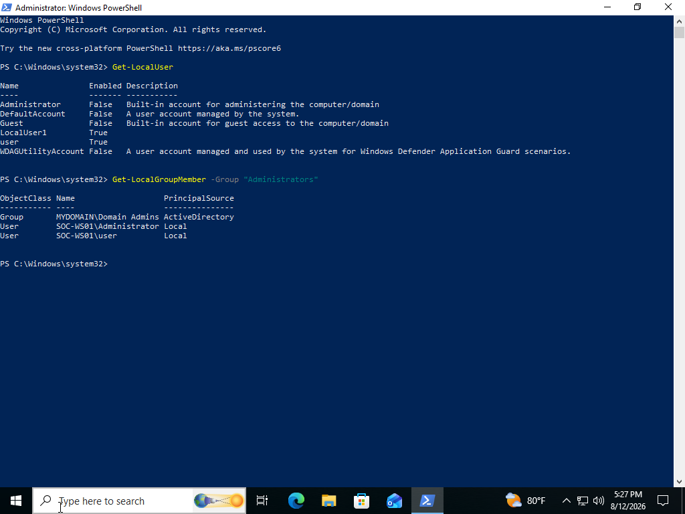
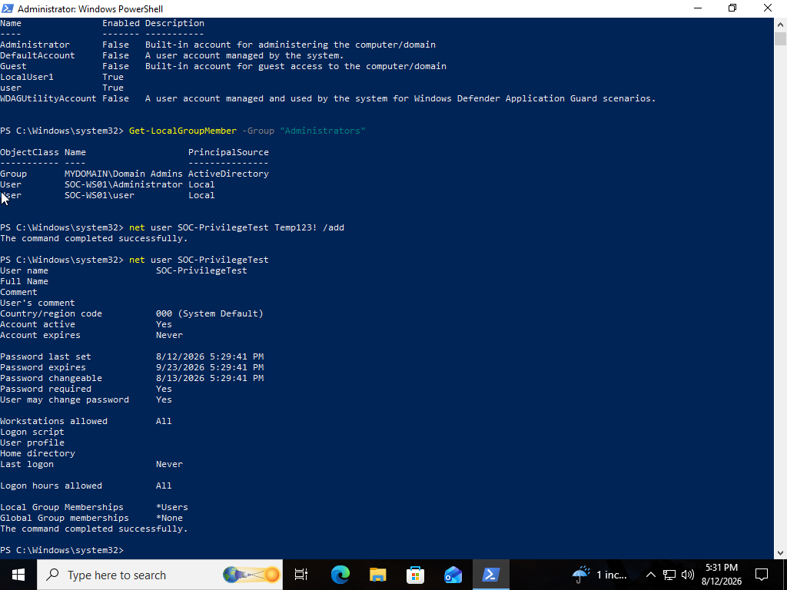
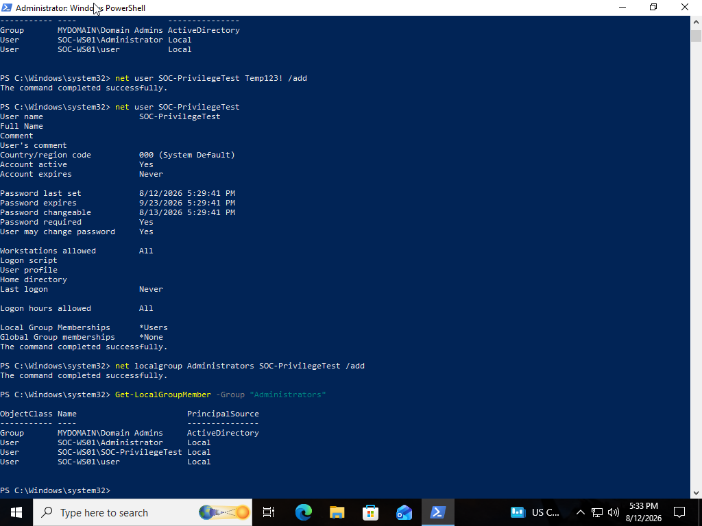
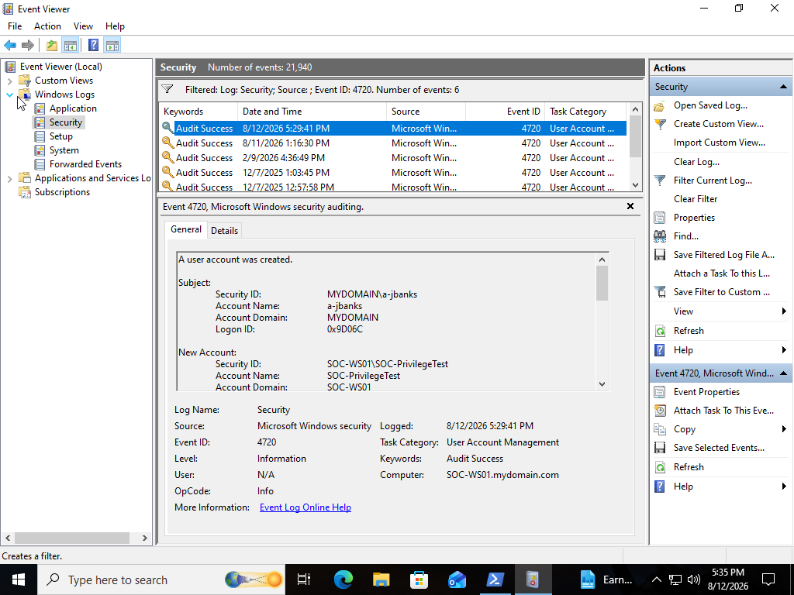
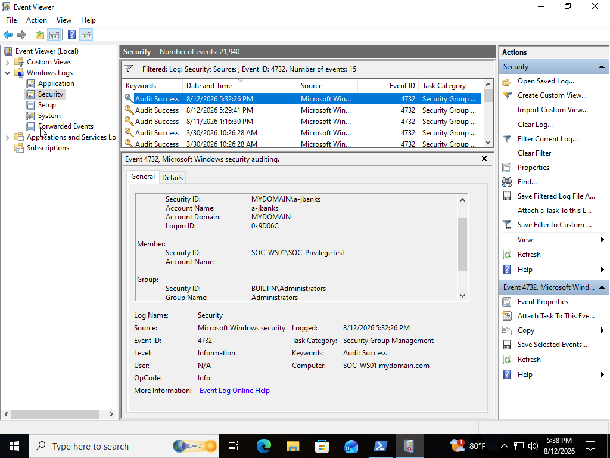
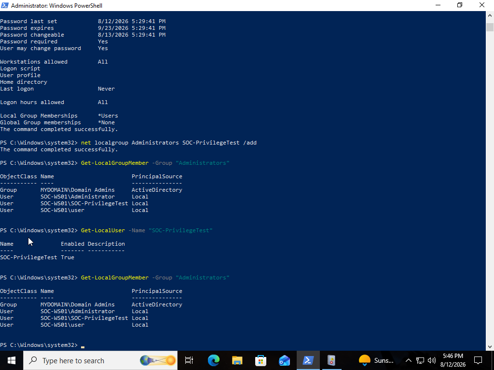
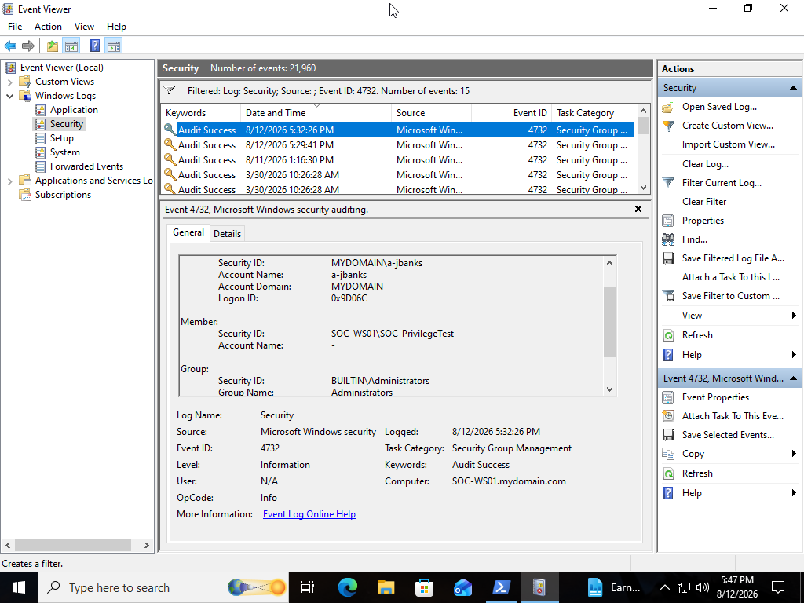

# SOC Analyst Lab #11 - Account & Privilege Investigation

## Project Overview

This project demonstrates how Windows account creation and privilege changes can be investigated using the Windows Security event log.

The lab focused on creating a controlled local user account, adding the account to the local Administrators group, analyzing the resulting Windows Security events, correlating account creation with privilege changes, and determining whether the activity would warrant further investigation in a production environment.

---

## Objectives

- Establish a baseline of privileged local accounts
- Generate controlled account creation activity
- Generate a controlled local privilege change
- Investigate Windows Security Event ID 4720
- Investigate Windows Security Event ID 4732
- Identify the actor responsible for account changes
- Identify the account receiving elevated privileges
- Correlate account creation and privilege changes
- Compare historical event data with current system state
- Document findings from a SOC analyst perspective

---

## Lab Environment

| Component | Details |
|---|---|
| Operating System | Windows 11 |
| Virtualization Platform | Oracle VirtualBox |
| Computer Name | SOC-WS01 |
| Primary Data Source | Windows Security Log |
| Investigation Tools | Event Viewer, PowerShell |

---

## Tools Used

- Windows PowerShell
- Windows Event Viewer
- Windows Security Log
- Local Users and Groups

---

## Investigation Scenario

A new local user account was created on a Windows workstation and subsequently added to the local Administrators group.

As the SOC analyst, the objective was to determine:

- Which account was created
- Who created the account
- When the account was created
- Whether the account received administrative privileges
- Who performed the privilege change
- Which Windows events recorded the activity
- Whether the activity appeared authorized
- Whether escalation would be appropriate

---

## Investigation Process

### Step 1 - Establish an Administrative Baseline

PowerShell was used to review existing local users:

```powershell
Get-LocalUser
```

The current membership of the local Administrators group was then reviewed:

```powershell
Get-LocalGroupMember -Group "Administrators"
```

This established a baseline before generating account and privilege changes.

---

### Step 2 - Create a Test Account

A dedicated local test account named:

```text
SOC-PrivilegeTest
```

was created.

The activity was intentionally generated to simulate account creation that might require investigation in a production environment.

Windows Security Event ID **4720** was generated to record the account creation.

---

### Step 3 - Grant Administrative Privileges

The test account was added to the local Administrators group.

PowerShell was then used to verify that `SOC-PrivilegeTest` appeared as a member of the group.

This generated security-relevant activity because the newly created account now possessed elevated local privileges.

---

### Step 4 - Investigate Event ID 4720

The Windows Security log was filtered for:

```text
4720
```

Event ID 4720 represents:

```text
A user account was created
```

The event was reviewed to distinguish between two important entities.

**Subject**

Identifies the account responsible for performing the action.

**New Account**

Identifies the account that was created.

This distinction is important during investigations because the actor and affected account are not necessarily the same.

---

### Step 5 - Investigate Event ID 4732

The Security log was filtered for:

```text
4732
```

Event ID 4732 represents:

```text
A member was added to a security-enabled local group
```

The event provided information about:

- The account responsible for the change
- The member that was added
- The affected security group
- The timestamp of the activity

The investigation confirmed that `SOC-PrivilegeTest` had been added to the local Administrators group.

---

### Step 6 - Correlate Account and Privilege Activity

The 4720 and 4732 events were correlated using:

- Account information
- Timestamps
- Actor information
- Target information
- Group membership

The resulting sequence was:

```text
Event ID 4720
New local account created
        ↓
SOC-PrivilegeTest
        ↓
Event ID 4732
Account added to Administrators
        ↓
Account receives elevated privileges
```

The close timing between account creation and privilege assignment provided important investigative context.

---

### Step 7 - Examine Current System State

PowerShell was used to verify the account's current state:

```powershell
Get-LocalUser -Name "SOC-PrivilegeTest"
```

and privileged group membership:

```powershell
Get-LocalGroupMember -Group "Administrators"
```

This demonstrated the distinction between:

**Security logs** — evidence of what happened historically.

**Current system state** — what exists on the endpoint at the time of investigation.

Both can provide useful evidence during incident analysis.

---

## Key Windows Security Events

| Event ID | Description |
|---:|---|
| **4720** | User account created |
| **4726** | User account deleted |
| **4732** | Member added to a security-enabled local group |
| **4733** | Member removed from a security-enabled local group |
| **4738** | User account changed |

### Event ID 4720

Provides evidence that a user account was created and identifies both the actor and newly created account.

### Event ID 4732

Provides evidence that an account was added to a local security group and identifies the actor, member, and affected group.

---

## Investigation Findings

The investigation determined:

- A new local account named `SOC-PrivilegeTest` was created.
- Windows Security Event ID 4720 recorded the account creation.
- The account was subsequently added to the local Administrators group.
- Windows Security Event ID 4732 recorded the group membership change.
- Event data identified both the actor responsible for the changes and the affected account.
- The account creation and privilege change occurred within the controlled lab scenario.
- The resulting administrative privileges were intentionally assigned.
- No unauthorized account or privilege modification occurred.

---

## SOC Analyst Assessment

The account creation and privilege change were determined to be authorized activity intentionally generated as part of the lab.

However, in a production environment, the creation of a new local account followed shortly by addition to the Administrators group would represent security-relevant activity requiring validation.

An analyst should determine whether the account creation was authorized, identify who performed the actions, review surrounding authentication and process activity, and determine whether the account was subsequently used.

Without an approved administrative explanation, unexpected creation of a privileged account could warrant escalation.

---

## Investigation Methodology

A useful investigation workflow demonstrated during this lab was:

```text
Identify account creation
        ↓
Determine actor
        ↓
Identify new account
        ↓
Review timestamp
        ↓
Identify group membership changes
        ↓
Determine affected group
        ↓
Correlate actor + target + timestamps
        ↓
Verify current account state
        ↓
Determine whether activity was authorized
```

---

## Why Privileged Account Changes Matter

Administrative privileges provide significantly greater control over an endpoint.

An unauthorized privileged account could potentially be used to:

- Modify system configurations
- Install software
- Access protected resources
- Disable security controls
- Create additional users
- Establish persistence
- Perform other privileged operations

For this reason, unexpected changes to privileged group membership deserve careful investigation.

---

## Potential Indicators of Suspicious Account Activity

Activity may warrant additional investigation when observing:

- Unexpected local account creation
- Newly created accounts immediately receiving administrative privileges
- Account creation by unusual users or processes
- Privileged accounts created outside approved maintenance windows
- Unfamiliar naming conventions
- Accounts created shortly after suspicious authentication
- Privilege changes followed by unusual process execution
- New accounts used for remote authentication
- Account creation occurring alongside persistence activity

No single indicator automatically confirms malicious activity.

---

## Cleanup

After completing the investigation, the test account was removed from the Administrators group and deleted.

The cleanup process may generate additional Windows Security events including:

| Event ID | Description |
|---:|---|
| 4733 | Member removed from a security-enabled local group |
| 4726 | User account deleted |

The Security event logs were retained as investigation evidence.

---

## Skills Demonstrated

- Windows account investigation
- Privileged account analysis
- Windows Security logs
- Event Viewer
- PowerShell
- Security Event ID 4720 analysis
- Security Event ID 4732 analysis
- Actor vs. target identification
- Timeline reconstruction
- Privilege escalation awareness
- Endpoint investigation
- SOC alert triage concepts
- Technical documentation

---

## Lessons Learned

This lab demonstrated why account creation and privilege changes should be analyzed together rather than as isolated events.

A newly created account may represent legitimate administrative activity. However, when that account immediately receives administrative privileges, the sequence becomes significantly more security-relevant.

Correlating the actor, target account, timestamps, group membership, and surrounding endpoint activity provides the context necessary to determine whether the activity was authorized or requires escalation.

The lab also reinforced the distinction between historical event evidence and the endpoint's current state.

---

## Screenshots

### Administrators Group Baseline



---

### Test Account Creation



---

### Account Added to Administrators



---

### Event ID 4720 - Account Created



---

### Event ID 4732 - Administrative Group Membership



---

### Account & Privilege Timeline


---

### Current Privileged Account State



---

### Privilege Investigation Evidence



---

## Conclusion

This project demonstrated how Windows account creation and privileged group membership changes can be investigated using PowerShell and Windows Security event logs.

By correlating Security Event IDs 4720 and 4732, I reconstructed the sequence between account creation and administrative privilege assignment and identified the actors and accounts involved.

Understanding these events provides an important foundation for investigating unauthorized account creation, privilege escalation, persistence, and identity-related security alerts in a SOC environment.
